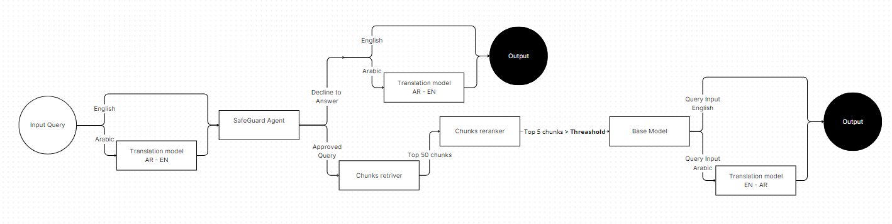

Here's a revised version of your **README** file with the addition of the **video demo** and **DFD (Data Flow Diagram)** section:

---

# **OSHA Saudi Arabia Regulatory Chatbot**

## **Project Overview**

This project focuses on developing a specialized AI-powered chatbot tailored for handling regulatory queries from the **OSHA GOSI Handbook** specific to Saudi Arabia. The chatbot is designed to provide **accurate, multi-lingual responses** (English and Arabic) to citizens and professionals seeking guidance on occupational safety regulations and personal protective equipment (PPE) standards.

The chatbot leverages **fine-tuned language models** and **Retrieval-Augmented Generation (RAG)** to offer detailed answers based on **domain-specific data**, such as regulatory texts, images, and tables.

---

## **Key Features**

- **Multilingual Support**: Provides responses in both **English** and **Arabic**, catering to a wide audience in Saudi Arabia.
- **Regulatory Query Handling**: Delivers accurate answers based on OSHA Saudi Arabia regulations, including personal protective equipment (PPE) guidelines.
- **Table and Image Support**: Capable of extracting and interpreting information from **complex tables** and displaying **images** from the handbook.
- **Mitigative Responses**: Provides appropriate mitigative answers for sensitive queries, such as those related to medical advice or life-threatening scenarios using **An AGENT that I built as a layer** [Gemma2-9B SafeguardAI](https://huggingface.co/GhaouiY/gemma-2-9b-it_SafeguardAI).
- **Efficient Information Retrieval**: Utilizes **RAG** with **Dragon Retriever** for fast and relevant data retrieval.

---

## **Technical Details**

### **Architecture**

- **Backend**: The chatbot leverages the **Gemma2 9B** language model, fine-tuned for precision using **bf16** to optimize memory usage and performance.
- **RAG (Retrieval-Augmented Generation)**: Integrated for efficient retrieval of regulatory information from the vector database (**ChromaDB**).
- **Dragon Retriever**: Used for the initial retrieval of relevant information, followed by **re-ranking** with a **threshold** for enhanced response accuracy.
- **Frontend**: The interface is built using **Gradio**, offering a user-friendly experience for interacting with the chatbot.

---

## **Installation**

To set up the project locally, follow these steps:

### **Prerequisites**
- **Python 3.8+**
- **pip**
- **Virtual Environment (recommended)**

### **Dependencies**

To install the necessary dependencies for this project, follow the instructions below.

Key libraries include:
- **PyMuPDF**: For text, table, and image extraction from PDFs.
- **ChromaDB**: A vector database for data storage and retrieval.
- **Transformers**: For model fine-tuning and inference.
- **Gradio**: For building the web-based user interface.

#### Installation Steps:

##### For Windows:
1. **Set up a virtual environment**:
   ```bash
   python -m venv venv
   ```

2. **Activate the virtual environment**:
   ```bash
   venv\Scripts\activate
   ```

##### For Linux/Mac:
1. **Set up a virtual environment**:
   ```bash
   python3 -m venv venv
   ```

2. **Activate the virtual environment**:
   ```bash
   source venv/bin/activate
   ```

3. **Install the required libraries**:
   ```bash
   pip install torch
   pip install transformers
   pip install chromadb
   pip install termcolor
   pip install python-dotenv
   pip install gradio
   pip install "accelerate>=0.26.0"
   ```

---

### **Usage**

1. Clone the repository and navigate to the `deploy` directory:
   ```bash
   git clone https://github.com/GhaouiYoussef/OSHA_GOSI-ChatBot.git
   cd OSHA_GOSI-ChatBot/deploy
   ```

2. Run the main application:
   ```bash
   python main-app.py
   ```

**Note**: 
- You will need your Hugging Face token and request access to the **Gemma2** model to run this application properly.

---

## **Training and Fine-Tuning**

The chatbot was fine-tuned in two major phases:
1. **Mitigative Responses**: Focused on handling sensitive queries.
2. **Table Interpretation**: Fine-tuned for responding to table-related questions from the handbook.

Synthetic QA data was generated using **ChatGPT-4 mini**, and the **Dragon Retriever** was employed for real-time retrieval of information.

---

## **Video Demo**

To better understand the chatbot in action, check out the following video demo:

[

---

## **Data Flow Diagram (DFD)**

The following Data Flow Diagram (DFD) illustrates the flow of information within the chatbot system:



This diagram provides an overview of the key processes, such as data input, model interaction, and output generation.

---

## **Contributing**

Feel free to submit a pull request or open an issue if you have any suggestions for improvements or want to contribute to the project.

---

## **License**

This project is licensed under the MIT License. See the `LICENSE` file for more information.

---

## **Contact**

If you have any questions or need further clarification, please contact:

- **Youssef Ghaoui**  
- [LinkedIn Profile](https://www.linkedin.com/in/youssef-ghaoui-3a82a222a/)
